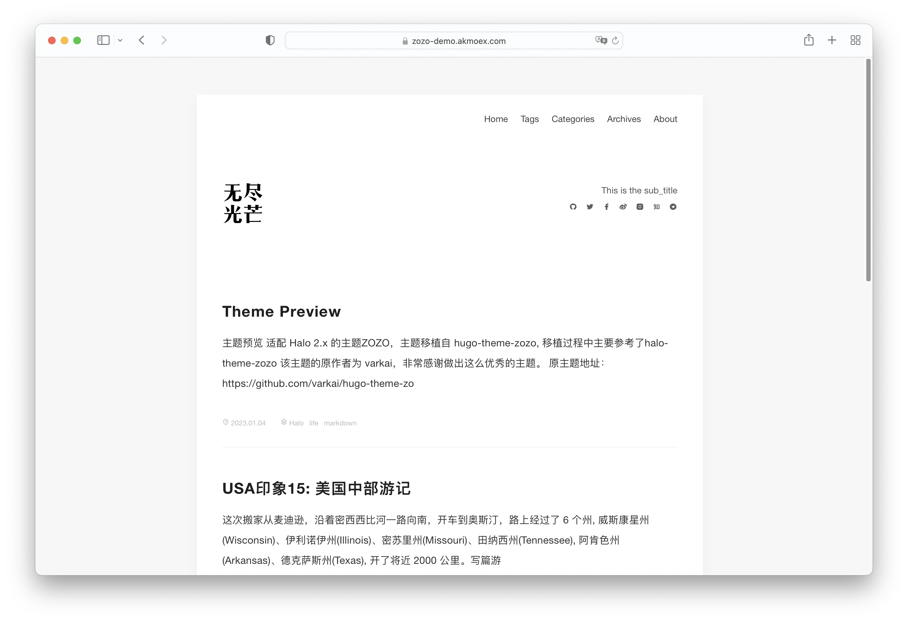

<h1><a href="https://github.com/AKmoex/theme-zozo" target="_blank">Halo Theme Zozo</a></h1>

## 说明

适配 Halo 2.x 的主题ZOZO，主题移植自 [hugo-theme-zozo](https://github.com/PCDotFan/Aragaki), 移植过程中主要参考[halo-theme-zozo](https://github.com/halo-dev/halo-theme-zozo)

该主题的原作者为 [varkai](https://github.com/varkai)，非常感谢做出这么优秀的主题。

原主题地址：[https://github.com/varkai/hugo-theme-zozo](https://github.com/varkai/hugo-theme-zozo)

## 预览地址

Demo：[https://zozo-demo.akmoex.com](https://zozo-demo.akmoex.com)

## 预览截图

## 安装方法

1. 进入[release](https://github.com/AKmoex/theme-zozo/releases)页面下载zip文件。
2. 进入后台 -> 外观 -> 主题。
3. 点击右上角 “切换主题”， 在弹出的窗口中选择 “安装主题”。
4. 选择下载好的主题包（zip）。
5. 安装完成后的主题将会出现在 “未安装” 内，点击启用主题

## 使用

1. 主题支持数学公式渲染(MathJax), 默认开启, 可在主题设置页面中关闭
2. 主题默认支持Disqus评论系统, 可以主题设置页面中停用, 暂不支持其它评论系统, 后续计划支持更多评论系统

